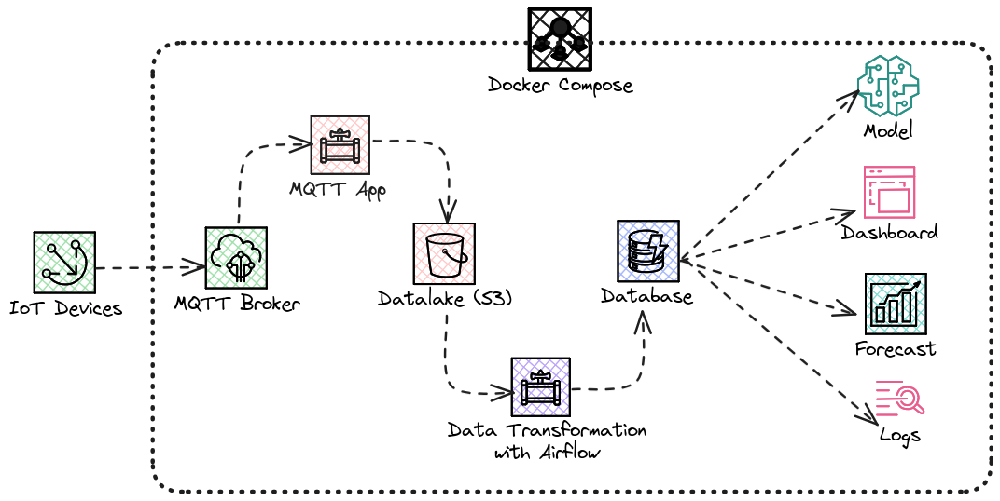

# IoT "Cloud" Data Pipeline
This repository helps you understand the basic components needed to build a data pipeline for IoT data and how they work together. Use this setup to test individual components or see how they function as a complete system. You can also expand this setup to create a more complex pipeline and deploy it to cloud platforms like AWS, Azure, or Google Cloud.

I chose Docker Compose for local deployment to focus on understanding the components and their interactions without the complexity of cloud providers. This approach also makes it easy to share the setup and run it on any machine with minimal effort.

The pipeline and infrastructure include:

- MQTT Broker
- MQTT Agent/Application
- Data Lake (MinIO)
- Database (Cassandra)
- REST API (FastAPI)
- Orchestration (Airflow)
- Transformation (ELT)

The components are connected as follows:



1. The **MQTT Broker** is the entry point for the data. It receives data from the IoT devices and publishes it to a topic.
2. The **MQTT Agent** subscribes to the topic and writes it to the **Data Lake**.
3. The **Data Lake** stores raw data and acts as the source for the **Transformation** component.
4. The **Transformation** reads raw data from the **Data Lake**, processes it, and writes it to the **Database**. **Airflow** is used to orchestrate the workflow.


## Table of Contents

[Prerequisites](#prerequisites)
[Component Testing](#component-testing)
- [MQTT Broker](#mqtt-broker)
- [Data Lake (MinIO)](#data-lake-minio)
- [Database (Cassandra)](#database-cassandra)
- [REST API (FastAPI)](#rest-api-fastapi)
- [Transformation (ELT)](#transformation-elt)

[Integration Testing](#integration-testing)
- [MQTT with Data Lake](#mqtt-with-data-lake)
- [Airflow Workflow](#airflow-workflow)

[Stopping and Cleaning Up](#stopping-and-cleaning-up)
[Good to know](#good-to-know)

## Prerequisites

- [Docker](https://docs.docker.com/get-docker/)
- [Docker Compose](https://docs.docker.com/compose/install/)

## Component Testing
### MQTT Broker

1. Build and Run

```sh
cd mqtt
docker build -t my-broker .
docker run -d --name my-broker -p 1883:1883 my-broker
```

2. Test MQTT Broker

- Subscribe to Topic

```sh
docker exec -it my-broker mosquitto_sub -h localhost -t test
```

3. Publish to Topic

In another terminal:

```sh
docker exec -it my-broker mosquitto_pub -h localhost -t test -m "hello"
```

### Data Lake (MinIO)

1. Build and Run

```sh
cd datalake
docker build -t my-datalake .
docker run -d --name my-datalake -p 9000:9000 -e "MINIO_ACCESS_KEY=minio" -e "MINIO_SECRET_KEY=minio123" my-datalake server /data --console-address ":9001"
```

2. Access Data Lake

Open http://localhost:9000 in your browser.

- Access Key: minio
- Secret Key: minio123

If not accessible via localhost, use the container's IP address:

```sh
docker logs my-datalake
```

### Database (Cassandra)

1. Build and Run

```sh
cd database
docker build -t my-db .
docker run -d --name my-db -p 9042:9042 my-db
```

2. Test Cassandra with cqlsh

```sh
docker exec -it my-db cqlsh localhost
```

3. Run the following commands in cqlsh:

```sql
    CREATE KEYSPACE iot WITH REPLICATION = { 'class' : 'SimpleStrategy', 'replication_factor' : 1 };
    USE iot;
    CREATE TABLE measurements (id UUID PRIMARY KEY, temperature float, battery_level float);
    INSERT INTO measurements (id, temperature, battery_level) VALUES (uuid(), 25.0, 50.0);
    SELECT * FROM measurements;
```

### REST API (FastAPI)

1. Build and Run

```sh
cd restapi
docker build -t api .
docker run -d --name api -p 8000:8000 --link my-db:my-db api
```

2. Test API

For debugging:

```sh
docker run -it --name api -p 8000:8000 --link my-db:my-db api bash
```

- Send Data to the Database

```sh
curl -X GET "http://localhost:8000/data/{id}" -H "accept: application/json" -d '{"temperature": 25.0, "battery_level": 50.0}'
```

- Get Data from the Database

```sh
curl -X POST "http://localhost:8000/data/{id}" -H "accept: application/json"
```

### Transformation (ELT)

1. Build and Run

```sh
docker-compose -f docker-compose.yml.etl_test up --build
```

2. Verify Data

```sh
docker exec -it my-db cqlsh localhost
```

3. Run the following commands in cqlsh:

```sql
USE iot;
SELECT * FROM measurements;
```

## Integration Testing
### MQTT with Data Lake
    
1. Build and Run

```sh
docker-compose -f docker-compose.yml.mqtt_app_test up --build
```

2. Publish Test Data

```sh
cd mqtt/
python mqtt_publisher_test.py
```

### Airflow Workflow

1. Build and Run

```sh
docker-compose -f docker-compose.yml up --build
```

2. Publish Test Data

```sh
cd mqtt/
python mqtt_publisher_test.py
```

3. Access Airflow

Log in to http://localhost:8080 with:

- Username: airflow
- Password: airflow

Trigger the DAG:

- Click on "transform_data" under the "DAG" tab.
- Click "Trigger DAG" or the "Play" button.

4. Verify Data

```sh
docker exec -it my-db cqlsh localhost
```

Run the following commands in cqlsh:

```sql
USE iot;
SELECT * FROM measurements;
```

## Stopping and Cleaning Up

1. Remove All Containers

```sh
./tools/delete_containers.sh
```

2. Delete All Images

```sh
./tools/delete_docker_images.sh
```

# Good to know
- There is a `.env` file in the root directory that sets environment variables for the services. You can modify this file as needed.
